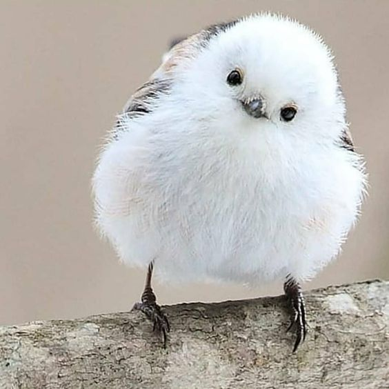

<!DOCTYPE html>
<html lang="ko">
<head>
    <meta charset="UTF-8">
    <meta name="viewport" content="width=device-width, initial-scale=1.0">
    <title>X 스타일 UI</title>
    <link rel="stylesheet" href="style5.css">
</head>

<body>
    <!-- 상단 화살표와 Post 버튼 -->
    

        <button class="back-arrow">←</button>
        <h1>Post</h1>
    

    

        

            <ul>
                <li><a href="#">X</a></li>
                <li><a href="#">🏠 Home</a></li>
                <li><a href="#">🔍 Explore</a></li>
                <li><a href="#">🔔 Notifications</a></li>
                <li><a href="#">✉️ Messages</a></li>
                <li><a href="#">📊 Grok</a></li>
                <li><a href="#">🔖 Bookmarks</a></li>
                <li><a href="#">👜 Jobs</a></li>
                <li><a href="#">👥 Communities</a></li>
                <li><a href="#">⭐ Premium</a></li>
                <li><a href="#">✅ Verified Orgs</a></li>
                <li><a href="#">🙍 Profile</a></li>
                <li><a href="#">⋯  More</a></li>
                <li><a href="#" class="post-btn"> Post</a></li>
            </ul>
        

    

        

            

                
                

                    별
                    @by_beep
                    · 7:02 PM · Feb 18, 2021
                

            

            

                
근방 10km 내에 아무도 없는 편의점에서 귀신이랑 술래잡기 3일 하고 이천만 원 받기. vs 그냥 살기.

                
참고로 귀신 이렇게 생김↓

                
l

                
l

                
l

                
l

                
l

                
l

                
l

                
l

                
l

                
l

                
l

                
l

                
l

                
l

                
l

                
l

                
l

                
l

                
l

                
l

                
l

                
l

                
l

                
l

                
l

                
l

                
l

                
l

                
l

                
l

                
l

                
l

                
l

                
l

                
l

                
l

                
l

                
l

                
↓

        

        

                
            

            

                💬 27
                🔁 40
                ❤️ 28
            

        

    

        

            

                <h3>South Korea trends</h3>
                <ul>
                    <li>1 · Trending 개쓰레기 요일 7,370 posts</li>
                    <li>2 · Trending 백천청명 1,397 posts</li>
                    <li>3 · Trending 문대가또 1,215 posts</li>
                    <li>4 · Trending 연쇄살인마 6,310 posts</li>
                    <li>5 · Trending 올영세일 5,770 posts</li>
                    <li>6 · Trending 조심해 5,890 posts</li>
                    <li>7 · Trending 청려문대 7,771 posts</li>
                    <li>8 · Trending 모의고사 3,115 posts</li>
                 </ul>
              

        

    

</body>
</html>
